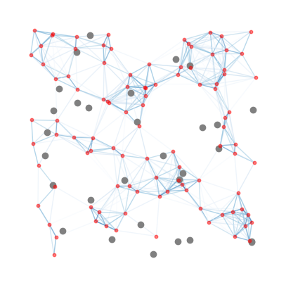

<figure>
    <!-- Image source can be a local file or a URL -->
    
    
    <!-- Caption for the figure -->
    <figcaption>Caption describing the figure.</figcaption>
</figure>

# Swarm-Induced Graph - Oil Spill Cleanup

## Overview
This project focuses on the simulation of a robotic swarm used for oil spill cleanup. By analyzing the positions of 'robots' at each timestep, the system computes pair-wise distances to understand their interactions and communication capabilities. The primary goal is to create and analyze a graph that represents communication links between robots that are within a certain proximity of each other.

## Components

### Part 1: Analysis of Robot Positions
- **Source**: Utilizes a file named "example_freeze" which contains the robot locations at each timestep.
- **Generation**: The data is generated by an external C++ program using liquidfun robotics swarm technology, developed by Calum Emrie at the University of Edinburgh.

### Part 2: Vectorized Swarm Simulation
- **Implementation**: Implemented using numpy to simulate the dynamics of the swarm.
- **Elements**: The simulation includes both robots and oil particles, which move randomly within the environment.
- **Interaction**: As of now, there is no direct interaction modeled between the robots and the oil particles. Future iterations may include such dynamics.

## Instructions for Use
- Ensure all dependencies are installed (list any required libraries or frameworks).
- Run the Jupyter Notebook to see the simulation in action.
- Modify parameters as needed to observe different behaviors of the robotic swarm.

## Acknowledgements
Project developed by Galen Wilkerson.

## Future Work
- Introduce interaction models between robots and oil.
- Enhance the visualization of the swarm's movement and communication networks.
- Implement performance metrics for assessing the effectiveness of the cleanup process.
